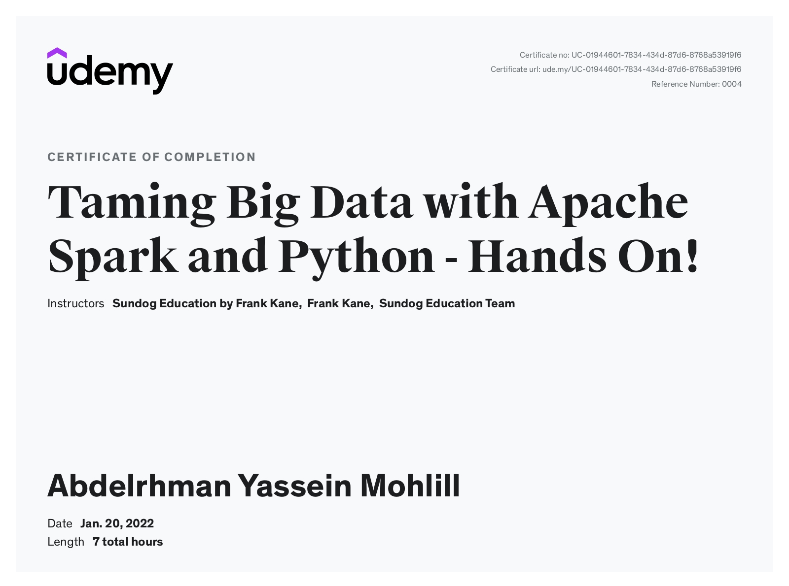

<!-- TABLE OF CONTENTS -->

  
Table of Contents

  <ol>
    <li>
      <a href="#about-the-project">About The Course</a>
      <ul>
        <li><a href="#built-with">Built With</a></li>
      </ul>
    </li>
    <li><a href="#contact">Contact</a></li>
  </ol>

<!-- ABOUT THE PROJECT -->
## About The Course

 Taming Big Data with Apache Spark and Python - Hands On! 

 ## Course Content 
 1. Use DataFrames and Structured Streaming in Spark 3
 2. Frame big data analysis problems as Spark problems
 3. Use Amazon's Elastic MapReduce service to run your job on a cluster with Hadoop YARN
 4. Install and run Apache Spark on a desktop computer or on a cluster
 5. Use Spark's Resilient Distributed Datasets to process and analyze large data sets across many CPU's
 6. Implement iterative algorithms such as breadth-first-search using Spark
 7. Use the MLLib machine learning library to answer common data mining questions
 8. Understand how Spark SQL lets you work with structured data
 9. Understand how Spark Streaming lets your process continuous streams of data in real time
 10. Tune and troubleshoot large jobs running on a cluster
 11. Share information between nodes on a Spark cluster using broadcast variables and accumulators
 12. Understand how the GraphX library helps with network analysis problems

(<a href="#top">back to top</a>)

### Built With

* Python
* Visual Studio
* Spark

(<a href="#top">back to top</a>)

Taming Big Data with Apache Spark and Python - Hands On!

<!-- ### Prerequisites

* Cloudera vm -->
 

### Certificate
[Apache Spark with Scala - Hands On with Big Data ](https://www.udemy.com/certificate/UC-01944601-7834-434d-87d6-8768a53919f6/)

## Contact

######  **Abdelrhman Yassein  :**  [LinkedIn](https://www.linkedin.com/in/Abdelrhman-Yassein/) - [GitHub](https://github.com/Abdelrhman-Yassein?tab=repositories)

Course Link: [Taming Big Data with Apache Spark and Python - Hands On!](https://www.udemy.com/course/taming-big-data-with-apache-spark-hands-on/)

(<a href="#top">back to top</a>)

